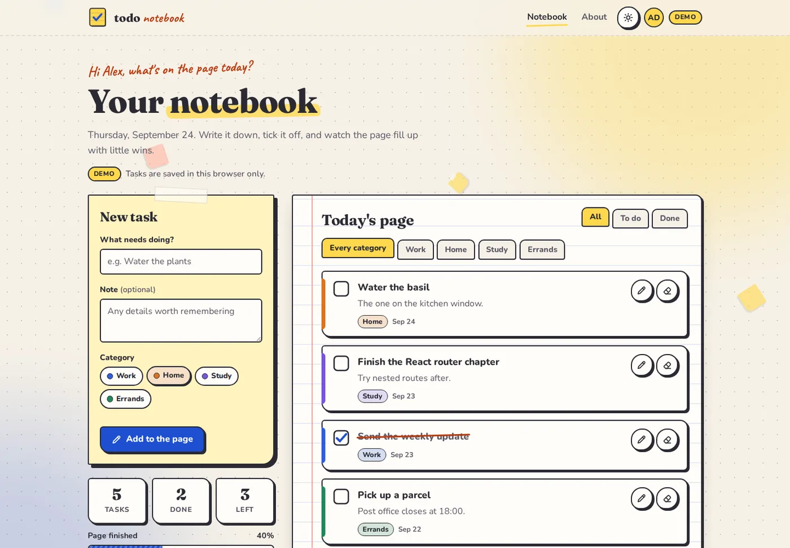
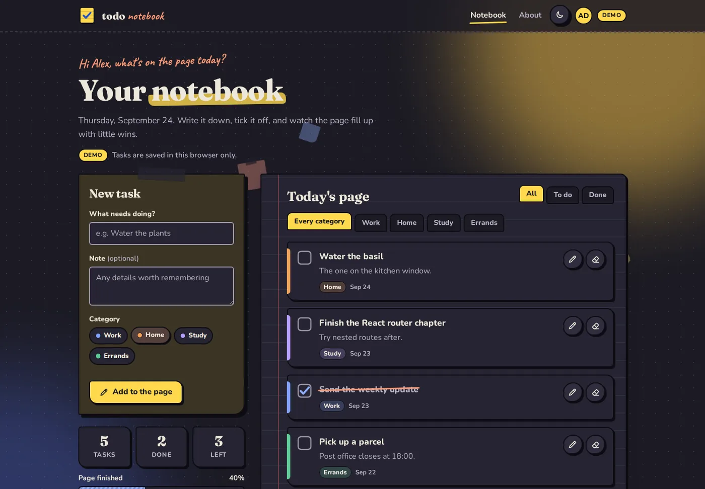
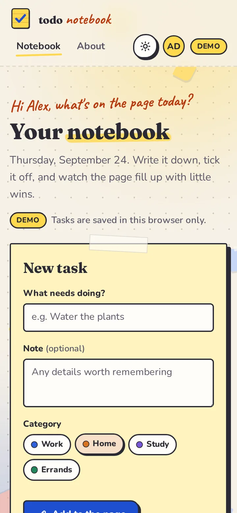

[English](README.md) · **Lietuviškai**

# Todo Notebook

Užduočių sąrašas, kuris primena popierinę užrašų knygelę: užduotį užsirašai ant lipnaus lapelio, pažymi ją liniuotame lape ir stebi, kaip pildosi progreso juosta.

**[▶ Gyva demo versija](https://brutall100.github.io/todo-notebook/)** · **[Kodas](https://github.com/brutall100/todo-notebook)**



<p>
  
  
</p>

## Apie projektą

Todo Notebook yra pilna užduočių valdymo programėlė. Ją sudaro React naršyklės dalis ir Express + MongoDB serveris (API). Žmogus susikuria paskyrą, prisijungia ir mato **tik savo** užduotis.

Projektas veikia dviem režimais:

| Režimas | Kur | Duomenys | Paskyros |
|---|---|---|---|
| **Demo** | GitHub Pages (gyva demo versija) | Saugomi naršyklėje (`localStorage`) | Išgalvotas demo vartotojas „Alex Doe“ |
| **Serverio** | Tavo kompiuteryje, paleidus API | Saugomi MongoDB | Tikra registracija ir prisijungimas su JWT |

GitHub Pages moka rodyti tik statinius failus, todėl gyva demo versija veikia be serverio. Pilną versiją išbandysi paleidęs projektą savo kompiuteryje.

## Galimybės

- Užduotis galima pridėti, redaguoti, pažymėti kaip atliktas ir ištrinti
- Keturios kategorijos su savo spalvomis: Darbas, Namai, Mokslai, Reikalai
- Filtrai pagal būseną (Visos / Neatliktos / Atliktos) ir pagal kategoriją
- Statistika su „suskaičiuojančiais“ skaičiais ir dryžuota progreso juosta
- Registracija ir prisijungimas: slaptažodžiai užšifruojami su bcrypt, sesijos saugomos su JWT, kiekvienas mato tik savo užduotis
- **Gyvas fonas**: taškuotu stalu atsitiktiniu greičiu krenta ir sukasi lipnūs lapeliai, o už jų lėtai plaukioja lempos ir rašalo švytėjimas
- Popieriniai mygtukai: užvedus pelę pakyla, paspaudus nusileidžia ir palieka **rašalo dėmę**; užvedus pelę pieštukas pradeda „rašyti“
- Ranka nupieštos varnelės ir perbraukimai, o pavadinimą paryškina žymeklio brūkšnys
- Šviesus ir tamsus režimai: pasirenkamas pagal sistemos nustatymą, įsimenamas, puslapis kraunantis nesumirga
- Prieinamumas: nuoroda „Skip to content“, matomas fokusas, laukeliai su pavadinimais (`<label>`), naršyklės `<dialog>` langas ir `prefers-reduced-motion` palaikymas (lapeliai nustoja kristi, lieka tik statiškas švytėjimas)
- Veikia 390px pločio telefone, puslapis neslenka į šoną; telefone lapelių perpus mažiau

## Kuo sukurta

| Dalis | Įrankiai |
|---|---|
| Naršyklės dalis | React 18, Vite 6, React Router 7 (hash maršrutai GitHub Pages), PropTypes |
| API | Node.js 20+, Express 4, Mongoose 8 |
| Duomenų bazė | MongoDB |
| Saugumas | bcryptjs (slaptažodžių šifravimas), jsonwebtoken (JWT), Mongoose `sanitizeFilter` nuo NoSQL injekcijų |
| Publikavimas | GitHub Actions → GitHub Pages |

### Spalvų paletė

Visos spalvos yra CSS kintamieji faile [`client/src/styles/tokens.css`](client/src/styles/tokens.css). Pakeitęs jas ten, pakeisi visos programėlės išvaizdą.

| Paskirtis | Šviesus | Tamsus |
|---|---|---|
| Fonas (stalas) | `#F6F1E7` | `#1C1B24` |
| Paviršius (lapas, kortelės) | `#FFFDF8` | `#262532` |
| Lipnus lapelis | `#FFF3BF` | `#3A3425` |
| Tekstas (rašalas) | `#2B2A33` | `#EDE7DA` |
| Akcentas (rašalo mėlyna) | `#1F4FD1` | `#8FB0FF` |
| Paryškinimas (lapelio geltona) | `#FFD84D` | `#FFD84D` |
| Raudonas rašiklis (ranka rašytas tekstas, klaidos) | `#B93A10` | `#FF9A76` |

Visos teksto spalvos atitinka WCAG AA: paprasto teksto kontrastas bent 4.5:1, sąsajos elementų bent 3:1.

### Šriftai (Google Fonts)

- **Fraunces**: antraštės
- **Nunito**: tekstas
- **Caveat**: „ranka rašyti“ užrašai

## Ko išmokau

- Padalinti programėlę į React naršyklės dalį ir REST API ir sujungti jas per `fetch` su prieigos raktu (bearer token)
- Šifruoti slaptažodžius su bcrypt ir apsaugoti maršrutus JWT tarpine programine įranga (middleware)
- Kiekvieną užklausą į duomenų bazę riboti prisijungusiu vartotoju, kad niekas negalėtų skaityti ar keisti svetimų užduočių
- Sukurti vieną duomenų sluoksnį su dviem variantais (naršyklės demo ir tikras API), kad ta pati sąsaja veiktų ir GitHub Pages, ir lokaliai
- Padaryti taupų animuotą foną, kuris animuoja tik `transform` ir `opacity` ir gerbia sumažinto judėjimo nustatymą
- Keisti temas per CSS kintamuosius ir apsisaugoti nuo tamsaus režimo sumirgėjimo mažu skriptu, kuris paleidžiamas prieš nupiešiant puslapį
- Spalvų kontrastą tikrinti skaičiais, o ne iš akies

## Kaip paleisti savo kompiuteryje

Reikia **Node.js 20+**. Serverio režimui dar reikia **MongoDB** (savo kompiuteryje arba nemokamo MongoDB Atlas klasterio).

### 1. Demo režimas (be duomenų bazės)

```bash
cd client
npm install
npm run dev
```

Atidaryk adresą, kurį parodys Vite (dažniausiai http://localhost:5173). Užduotys saugomos naršyklėje.

### 2. Serverio režimas (tikros paskyros ir duomenų bazė)

**API:**

```bash
cd server
cp .env.example .env
npm install
npm run dev
```

Faile `server/.env` užpildyk:

- `MONGO_URI`: MongoDB prisijungimo adresas
- `JWT_SECRET`: ilga atsitiktinė eilutė (faile yra komanda, kuri ją sugeneruoja)
- `PORT`, `DB_NAME` ir `CLIENT_ORIGIN` gali likti tokie, kokie yra

**Naršyklės dalis** (antrame terminale):

```bash
cd client
cp .env.example .env
npm install
npm run dev
```

Faile `client/.env` yra eilutė `VITE_API_URL=http://localhost:3030`. Ji liepia naršyklės daliai jungtis prie API, o ne veikti demo režimu. Ištrink tą eilutę (arba visą failą), ir vėl bus demo režimas.

### API adresai

| Metodas | Kelias | Ką daro |
|---|---|---|
| `POST` | `/api/auth/register` | Sukuria paskyrą → `{ token, user }` |
| `POST` | `/api/auth/login` | Prijungia su el. paštu ir slaptažodžiu → `{ token, user }` |
| `GET` | `/api/auth/me` | Grąžina prisijungusį vartotoją |
| `GET` | `/api/todos` | Tavo užduotys |
| `POST` | `/api/todos` | Prideda užduotį |
| `PATCH` | `/api/todos/:id` | Redaguoja arba pažymi užduotį |
| `DELETE` | `/api/todos/:id` | Ištrina užduotį |

Visiems `/api/todos` adresams reikia antraštės `Authorization: Bearer <token>`.

## Projekto struktūra

```
todo-notebook/
├── client/                    React programėlė (Vite)
│   ├── public/                favicon.svg, theme-init.js (nustato temą prieš piešiant)
│   ├── src/
│   │   ├── api/               demo-api.js (naršyklė), http-api.js (serveris), index.js išrenka
│   │   ├── components/        antraštė, užduoties forma, užduotis, gyvas fonas, mygtukai…
│   │   ├── context/           auth-context.jsx
│   │   ├── hooks/             tema, skaičiavimas, sumažintas judėjimas
│   │   ├── pages/             pagrindinis, apie, 404
│   │   ├── styles/            tokens.css (paletė), base, background, components, pages
│   │   └── config/            categories.js
│   └── .env.example
├── server/                    Express API
│   ├── src/
│   │   ├── models/            user.js, todo.js
│   │   ├── routes/            auth.js, todos.js
│   │   ├── middleware/        require-auth.js (JWT patikra)
│   │   ├── app.js, config.js, index.js
│   └── .env.example
├── docs/                      ekrano nuotraukos
├── .github/workflows/         deploy.yml (GitHub Pages)
└── LICENSE
```

## Padėkos

- Pradėta nuo oficialaus [Vite React šablono](https://github.com/vitejs/vite/tree/main/packages/create-vite) (MIT)
- Šriftai [Fraunces](https://fonts.google.com/specimen/Fraunces), [Nunito](https://fonts.google.com/specimen/Nunito) ir [Caveat](https://fonts.google.com/specimen/Caveat) iš Google Fonts (SIL Open Font License)
- Ikonos yra rankų darbo SVG faile `client/src/components/icons.jsx`
- „Alex Doe“ yra išgalvotas demo vartotojas

## Licencija

[MIT](LICENSE) © 2026 brutall100
